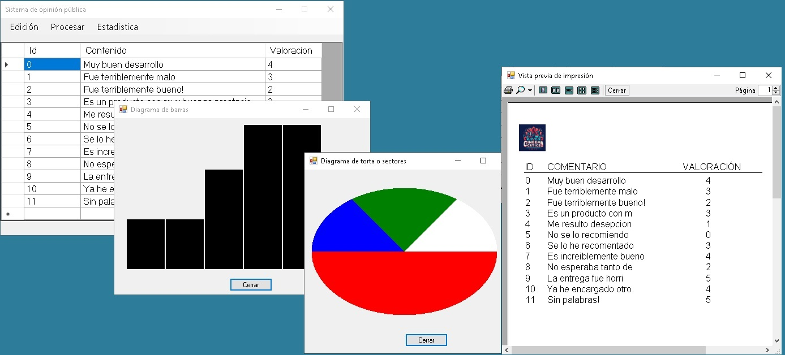

# Laboratorio 2 - Guía 10 - Impresión y gráficos

La imagen debajo muestra tres temas correspondientes al ejercicio 1:

* Impresión de un listado
* Dibujo de un gráfico de barras (básico)
* Dibujo de un gráfico de sectores (básico)

En el listado queda pendiente de indicar el número de pagina.
En ambos gráficos queda pendiente de agregar las etiquetas correspondientes.

<div align="center">
  
</div>

<details>
<summary> Impresión del listado </summary>


```csharp
        private void printDocument1_PrintPage(object sender, System.Drawing.Printing.PrintPageEventArgs e)
        {
            Graphics g = e.Graphics;
            Font font = new Font("Arial", 12);
            Brush brush = new SolidBrush(Color.Black);
            Pen pen = new Pen(brush);

            float x = 20, y = 40;

            Image image = Image.FromFile("../../recursos/img/logo.jpg");
            Rectangle rect = new Rectangle((int)x, (int)y, 50, 50);
            g.DrawImage(image, rect);

            y += 70;

            g.DrawString($"{"ID",-10}", font, brush, x + 10, y);
            g.DrawString($"{"COMENTARIO",-25}", font, brush, x + 50, y);
            g.DrawString($"{"VALORACIÓN",-10}", font, brush, x + 500, y);
            y += 20;

            g.DrawLine(pen, x + 10, y, x + 650, y);
            y += 5;

            for (int n = linea, m = 0; linea < comentarios.Count && m < cantXPagina; n++, linea++, m++)
            {
                Comentario c = comentarios[n];
                g.DrawString($"{c.Id.ToString(),-10}", font, brush, x + 10, y);

                string contenido = c.Contenido;
                if (contenido.Length > 25) contenido = contenido.Substring(0, 20);
                g.DrawString($"{contenido,-25}", font, brush, x + 50, y);

                g.DrawString($"{c.Valoracion.ToString(),10}", font, brush, x + 500, y);
                y += 20;
            }

            if (linea >= comentarios.Count)
                e.HasMorePages = false;
            else
                e.HasMorePages = true;
        }
```
</details>

<details> 
  
<summary>Gráfico de barras (simplificado)</summary>

```csharp
       private void pictureBox1_Paint(object sender, PaintEventArgs e)
        {
            Graphics g = e.Graphics;

            int w = pictureBox1.Width;
            int h = pictureBox1.Height;

            //agrego la idea de escalamiento, para que el maximo valor ocupe toda la altura disponible
            int maximo = GetMaximo();
            float factorEscala = 1f*h / maximo;// la cosa es que cuando multiplique por el maximo me de 1, 
                                               //ocupando toda la altura disponible, 

            Brush brush = new SolidBrush(Color.Black);

            int wbarra = (w - 10) / 6;//6 barras

            int pos = 0;
            foreach (KeyValuePair<string, string> key in Lista)
            {
                string clave = key.Key;
                int valor = Convert.ToInt32(key.Value);

                int hbarra = (int)factorEscala*valor;

                int x0 = 10 + pos * wbarra;
                int y0 = (h - 10) - hbarra;
                int wh = wbarra - 2;
                int hh = hbarra;

                pos++;

                g.FillRectangle(brush, x0, y0, wh, hh);

                //hay que realizar mejoras varias!
            }
        }
```
</details>

<details>
<summary>Gráfico de sectores (simplificado)</summary>
  
```csharp
        private void pictureBox1_Paint(object sender, PaintEventArgs e)
        {
            Graphics g = e.Graphics;

            int w = pictureBox1.Width;
            int h = pictureBox1.Height;

            #region margenes
            float m = 20;
            #endregion

            #region area cliente
            float wc = w - 2 * m;
            float hc = h - 2 * m;
            #endregion

            #region centro
            float x0 = wc / 2 + m;
            float y0 = hc / 2 + m;
            #endregion

            float ang0 = 0;
            int n = 0;
            foreach (float valor in Valores)
            {
                Brush brush = new SolidBrush(Colores[n++]);
                g.FillPie(brush, x0 - w / 2, y0 - hc / 2, wc, hc, ang0, valor);
                ang0 += valor;
            }
        }
```
</details>
